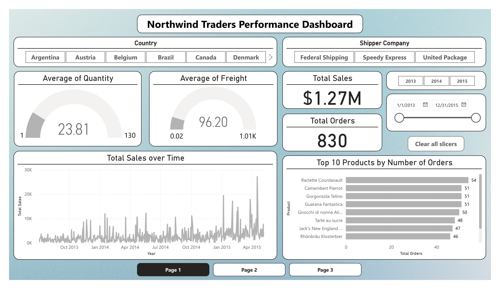
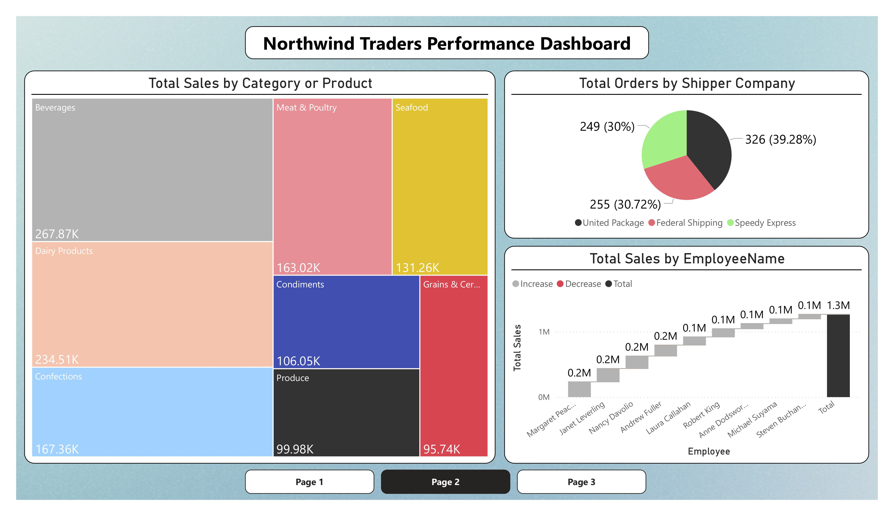
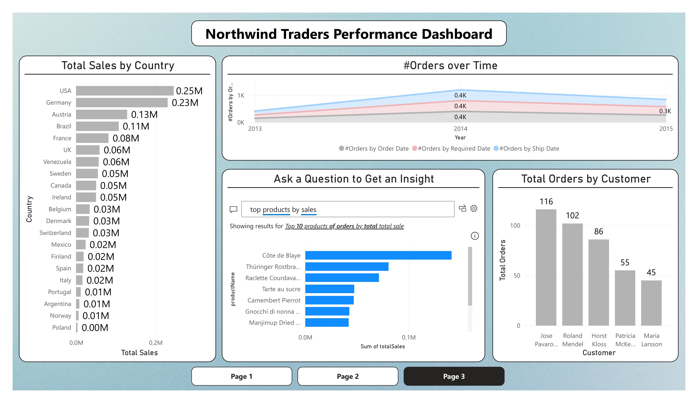

# Northwind Traders Performance Dashboard

A professional **Power BI** dashboard built using the classic **Northwind Traders** sample database. This interactive report provides insights into sales performance, order trends, product popularity, employee contributions, shipping details, and geographic distribution for the fictional specialty foods company.

## Project Overview
The Northwind database is a popular sample dataset from Microsoft, commonly used for learning data analysis, SQL, and BI tools. This repository includes:
- Excel files containing the core tables from the Northwind database.
- Screenshots of the Power BI dashboard pages.
- The `.pbix` file for the full interactive report.

The dashboard features slicers for Country, Shipper Company, and Year, allowing dynamic filtering across all visuals.

## Data Sources
The following Excel tables are included:

| File Name            | Description                     | Size |
|----------------------|---------------------------------|------|
| categories.xlsx     | Product categories              | 1 KB |
| customers.xlsx      | Customer details                | 7 KB |
| data_dictionary.xlsx| Metadata and descriptions       | 3 KB |
| employees.xlsx      | Employee information            | 1 KB |
| order_details.xlsx  | Order line items                | 42 KB |
| orders.xlsx         | Order headers                   | 46 KB |
| products.xlsx       | Product catalog                 | 4 KB |
| shippers.xlsx       | Shipping companies              | 1 KB |

## Dashboard Pages
The report has **three pages** with key insights:

### Page 1: Overview
- KPI cards: Average Quantity (23.81), Average Freight ($96.20), Total Sales ($1.27M), Total Orders (830)
- Total Sales over Time (line chart)
- Top 10 Products by Number of Orders (horizontal bar chart)

---

### Page 2: Category, Shipper & Employee Analysis
- Total Sales by Category/Product
- Total Orders by Shipper Company (pie chart)
- Total Sales by Employee (with increase/decrease indicators)

---

### Page 3: Country & Customer Insights
- Total Sales by Country (bar chart)
- Number of Orders over Time (area chart)
- Top products by sales (Q&A visual)
- Total Orders by Customer (bar chart)

---

## Technologies Used
- Microsoft Power BI Desktop
- Microsoft Excel (data source)

## How to Recreate the Dashboard
1. Download the Excel files.
2. Open Power BI Desktop.
3. Import all Excel files (Get Data → Excel).
4. Create relationships in the Model view (e.g., Orders → Order Details → Products → Categories).
5. Add visuals and slicers as shown in the screenshots.

This project is great for learning Power BI techniques like DAX, data modeling, and interactive visualizations.
